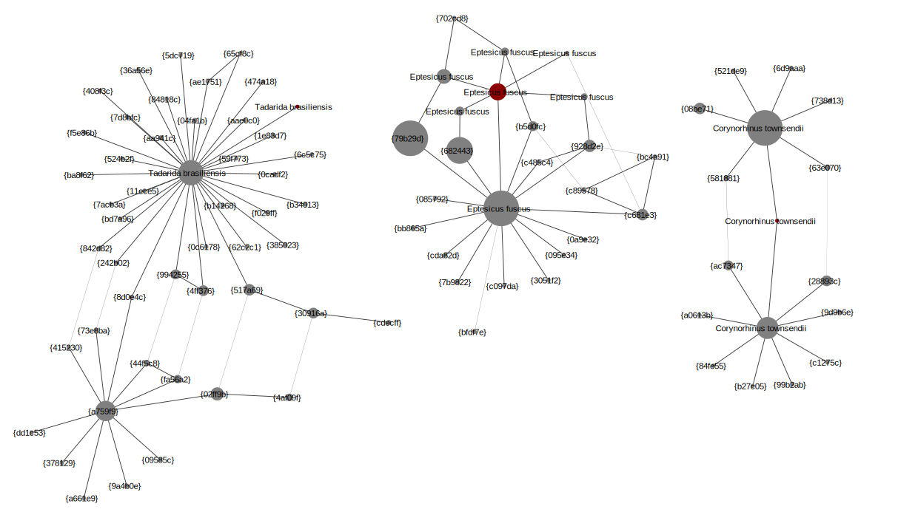

Database of 430 bats
====================

The mock communities of 3 bats in Walker *et al.* (2019) are made up of just
*Corynorhinus townsendii* (COTO), *Eptesicus fuscus* (EPFU) and *Tadarida
brasiliensis* (TABR). Following their analysis, we will use the same 430 bat
species for our reference database, available as a FASTA file of COI trimmed
markers as Supplementary S2 to the earlier paper Walker *et al.* (2016).

Running ``setup.sh`` will download that FASTA file as ``COI_430_bats.fasta``,
and we can load this into a new THAPBI PICT database using:

.. code:: console

    $ rm -rf COI_430_bats.sqlite  # delete any pre-existing DB
    $ thapbi_pict curated-import -d COI_430_bats.sqlite -i COI_430_bats.fasta -x
    File COI_430_bats.fasta had 430 sequences, of which 430 accepted.
    Of 430 potential entries, loaded 430 entries, 0 failed parsing.

Calling ``run.sh`` will first run the pipeline using the SFF_145f/SFF_351r
primers, this COI database, and the metadata as described earlier. This will
make an edit-graph named ``mock-community.COI_430_bats.edit-graph.xgmml``
which you can open in Cytoscape. This contains three main connected components
for the three expected species, and a smattering of singletons and other tiny
clusters. The ``--showdb`` option was used to  force inclusion of the database
entries (even if not seen in the samples).

Importantly, only the *Eptesicus fuscus* cluster includes a red node from the
database which is also in the samples. i.e. None of the sequence data from
*Corynorhinus townsendii* or *Tadarida brasiliensis* perfectly matches the
given reference species sequence. The three main clusters are shown below:

All three clusters have species labelled nodes. Starting on the left, we have
*Tadarida brasiliensis* where the reference is a one base pair edit away from
the dominant variant (seen in 27 samples). In the middle we have *Eptesicus
fuscus* where while the reference sequence was seen, once again it is not a
dominant variant (two variants were seen in 40 samples). Finally, on the right
for *Corynorhinus townsendii* the reference is a one base pair edit away from
the two dominant variants (seen in 40 and 23 samples).

This is a severve handicap for the default ``onebp`` classifier which looks
for identical matches or up to a single base pair different. We can either
switch to a fuzzier classifier (like the ``blast`` based classifier), or look
at filling in the database.

One option would be to add a (curated subset of) published sequences from the
NCBI. At the time of writing while that helps, there are still gaps here. What
the example in ``run.sh`` does is add all the sequences observed in at least
10 samples to the database with the presumed species. This is similar to how
the THAPBI PICT default database of *Phytophthora* ITS1 contains actually
observed variants from single species positive controls. It ceases to be an
entirely fair assessment, but comparing the Excel reports from the two
database the improvement is quite dramatic.

Looking at ``mock-community.COI_430_bats.samples.onebp.xlsx`` (430 references
only) compared to ``mock-community.COI_ext_bats.samples.onebp.xlsx`` (with an
extra 14 sequences added), the *Tadarida brasiliensis* detection improves
markedly (although is still spotted in only two of the 20 replicates where it
is the rare species - consistent with the published analysis and put down to
primer preference), and also there are far less unknown reads reported.
