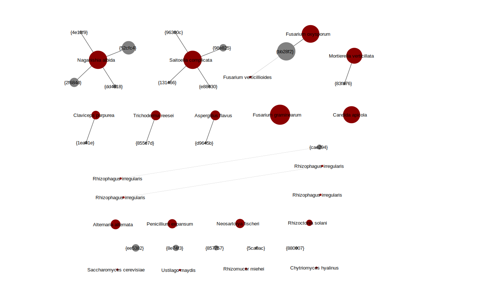
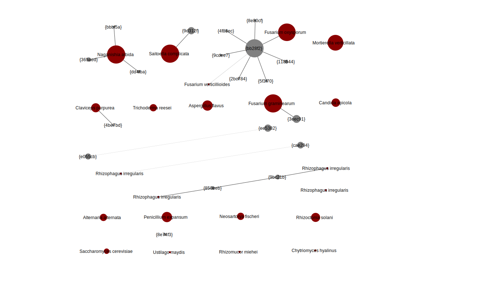
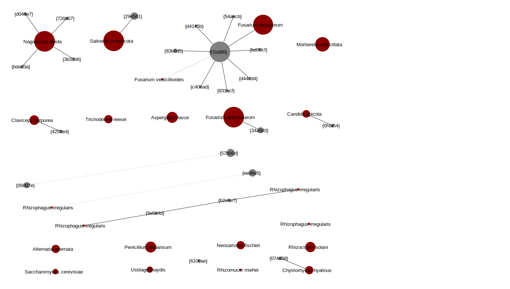
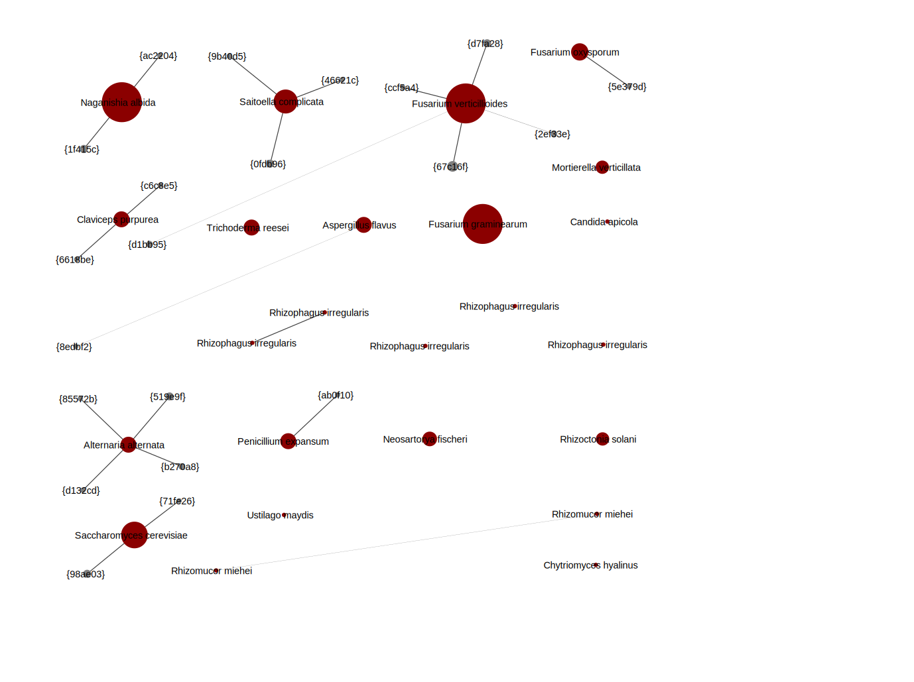

Community Edit Graphs
=====================

The sequence :ref:`edit_graph` is very useful for understanding what came off
the sequencer - although you may need to play with the thresholds to find a
sweet spot for hiding the noise.

My main conclusion from the figures below is that the THAPBI PICT default
``onebp`` classifier is reasonable for these fungal communities markers.
However, for the ITS1 marker *Fusarium* needs closer examination, and there
should be even more database entries for *Rhizomucor irregularis*. You would
of couse also need to expand the database beyound the 19 species in the mock
community to use these ITS1 or ITS2 fungal markers more generally.

Image generation
----------------

If you have loaded an XGMML network file from THAPBI PICT into Cytoscape, you
can interactively select nodes based on the ``Max-sample-abundance`` attribute
and hide or remove them. This is helpful for exploring what minimum threshold
to use for drawing a clear edit graph, but this does not update the
``Sample-count`` and node sizes which are based on it.

For that you can re-run ``thapbi_pict edit-graph`` with the higher sample
level minimum abundance setting (``-a`` or ``--abundance``). You do not need
to regenerate the intermediate per-sample FASTA files unless you want to use a
lower threshold.

The following figures are from the example script ``run.sh`` which called
``thapbi_pict edit-graph`` with ``-a 75``, meaning a unique sequence had to be
in a sample from at least 75 reads to be considered. Using a lower value gives
a much noiser picture (see the :ref:`halo_effect` discussed earlier).

Additionally this used ``-s`` (or ``--showdb``) to force including all of the
database sequences (dark red nodes), as some did not appear in the samples
(shown as the smallest dark red dots, typically the bottom row of the image).
And, it used ``-m -`` (or ``--method -``) to deliberatly not label the nodes
with the classifier output - only the data entries get a species label.

The XGMML files were loaded, automatically laid out using the "Perfuse Force
Directed Layout" menu, manually adjusted to give a reasonably consistent node
placement for comparison between the figures, and then images exported in SVG
format (other formats are also supported including PDF and PNG).

Amplicon library one - ITS1
---------------------------

Starting with amplicon library one, where the BITS/B58S3 primers were used for
a short fragment of ITS1.

This is from file ``amp_lib_one.BITS_B58S3.edit-graph.a75.xgmml`` created by
``run.sh``.

The dark red nodes represent sequences in the database - given how this
database was constructed to match the mock community, we would hope to see all
the database entries represented in the samples. Some are missing at this
abundance threshold (four bottom row entries *Saccharomyces cerevisiae*,
*Ustilago maydis*, *Rhizomucor miehei* and *Chytriomyces hyalinus*, plus the
four *Rhizomucor irregularis* entries shown accross the middle.

The large red nodes are the well represented community members, starting with
*Naganishia albida* shown top left, which has four different 1bp variants some
of which are large meaning they appear in many samples - you can see the
sample counts in you load the XGMML file for this graph in Cytoscape. These
are common enough to suggest they could be alternative versions of the ITS1
region in the genomes of these community members?

The (sometimes large) grey nodes not connected to a red node represent unwanted
reads, likely contaminations discussed later.

In general each species is reprented by a single connected component. The
exceptions are *Rhizomucor irregularis* (multiple distantly related entries)
and the *Fusarium*. The expected sequence for *Fusarium verticillioides* was
not seen at all, however there are a great many copies one base away from
the expected *Fusarium oxysporum* sequence (abbreviated MD5 checksum
``bb28f2``, in full ``bb28f2b57f8fddefe6e7b5d01eca8aea``). Is this perhaps
coming from the *Fusarium verticillioides* strain?

Amplicon library two - ITS1
---------------------------

First, analysed using the same BITS/B58S3 primers as for ITS1 as in amplicon
library one - the unique sequence MD5 checksums overlap with those seen in
amplicon one:

This is from file ``amp_lib_two.BITS_B58S3.edit-graph.a75.xgmml`` created by
``run.sh``.

Broadly the same as from amplicon library one, but notice the
presence/absense patterns are different. Also there are more variants of the
``bb28f2`` *Fusarium*, and a pair of unexpected grey nodes 3bp apart
(``e055cb`` and ``ee5482``, middle left, discussed below).

Now, using the actual primer pair, ITS1f/ITS2, which give a longer ITS1
fragment. Note that the sequences are extended so the checksums are different
to those in the preceeding images, but again broadly the same picture as the
two images above:

This is from file ``amp_lib_two.ITS1f_ITS2.edit-graph.a75.xgmml`` created by
``run.sh``.

The curious large grey node one edit away from *Fusarium oxysporum* has
abbreviated MD5 checksum ``f1b689``, or in full
``f1b689ef7d0db7b0d303e9c9206ee5ad`` (given in the XGMML node attributes).
Referring back to the intermediate FASTA files or the read report, this does
indeed represent the extended version of ``bb28f2b57f8fddefe6e7b5d01eca8aea``
with the first primer set::

    >bb28f2b57f8fddefe6e7b5d01eca8aea
    ATTACCGAGTTTACAACTCCCAAACCCCTGTGAACATACCAATTGTTGCCTCGGCGGATCAGCCCGCTCCCGGTAAAACG
    GGACGGCCCGCCAGAGGACCCCTAAACTCTGTTTCTATATGTAACTTCTGAGTAAAACCATAAATAAATCAA

    >f1b689ef7d0db7b0d303e9c9206ee5ad
    AAGTCGTAACAAGGTCTCCGTTGGTGAACCAGCGGAGGGATCATTACCGAGTTTACAACTCCCAAACCCCTGTGAACATA
    CCAATTGTTGCCTCGGCGGATCAGCCCGCTCCCGGTAAAACGGGACGGCCCGCCAGAGGACCCCTAAACTCTGTTTCTAT
    ATGTAACTTCTGAGTAAAACCATAAATAAATCAAAACTTTCAACAACGGATCTCTTGGTTCTG

Using an NCBI BLAST search, this exact sequence has been published from over a
dozen different *Fusarium* species incuding *Fusarium oxysporum*, but not at
the time of writing from *Fusarium verticillioides*.

The small pair of grey nodes 3bp apart (long diagonal line, middle left),
``57b06d`` and ``05007e``, are the extended equivalents of ``e055cb`` and
``ee5482`` shown in the same place in the previous image. They seem to match
*glomeromycetes*, perhaps from the *Rhizophagus* in the mock community.

Amplicon library two - ITS2
---------------------------

Finally, amplicon library two using the ITS3-KYO and ITS4-KYO3 primers for
ITS2:

This is from file ``amp_lib_two.ITS3-KYO2_ITS4-KYO3.edit-graph.a75.xgmml``
created by ``run.sh``.

Some more noteworthy changes to presence/absense, including much more
*Saccharomyces cerevisiae* (still drawn bottom left). Also there are no
unexpected grey nodes, and perhaps most interestingly from a species
classification point of view, now the three *Fusarium* species fall into
separate connected components.
