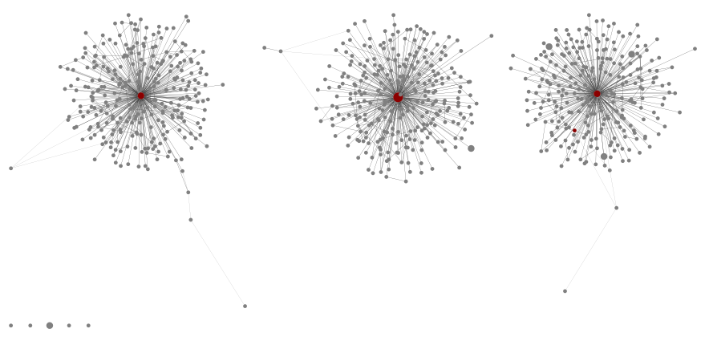
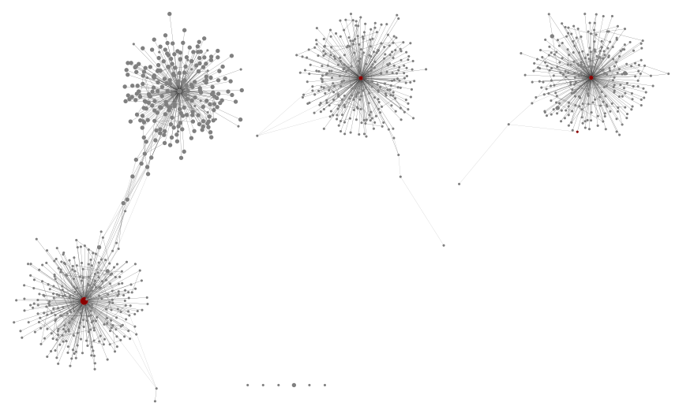
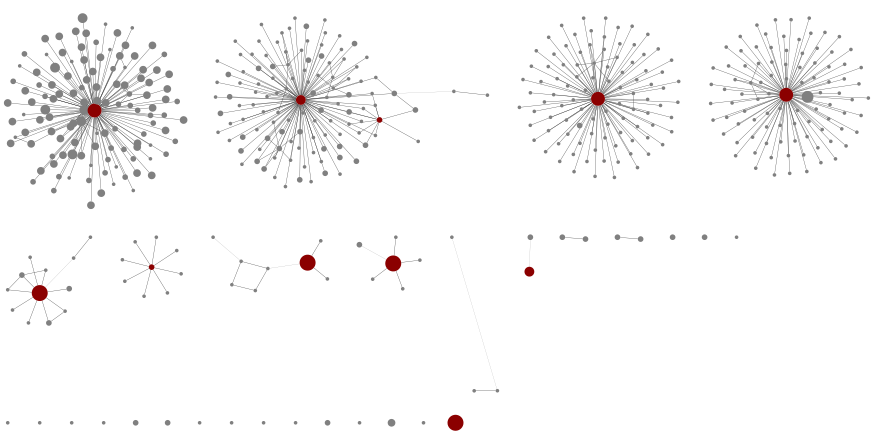
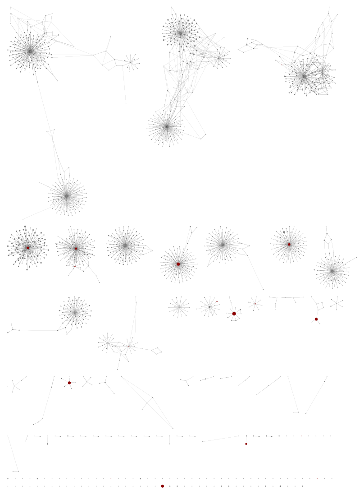

Edit Graphs
===========

The sequence :ref:`edit_graph` is very useful for understanding what came off
the sequencer - although you may need to play with the thresholds to find a
sweet spot for hiding the noise. Using ``run.sh`` you will get large noisy
XGMML files from running the pipeline at minimum abundance 10, but also
graphs using the default minimum abundance of 100, filenames
``SPH16S.edit-graph.a100.xgmml`` and ``MOL16S.edit-graph.a100.xgmml``, and
graphs for the mock community samples alone.

My main conclusion from the figures below is that the THAPBI PICT default
``onebp`` classifier is reasonable for these mock communities markers.
However, the MOL16S database needs considerable expansion for use on the
environmental samples. Perhaps updating this example in 5 years time there
will be enough published markers to assign species to all the unknowns here?

SPH16S
------

First SPH16S, where there are just the three samples for the mock communities.
Each is expected to have three species *Sphaerium simile*, *Sphaerium corneum*
and *Pisidium compressum* only. With a minimum abundance threshold of 100, we
get three nice clear graph components, and a few single nodes:

Next, using all the samples but again a sample level minimum abundance 100:

Very little change except the addition of a fourth cluster, some base pairs
away from the *Sphaerium simile* component and centred on this sequence::

    >79b63a2ef96b839ae3263369f8d390b9
    ACGTGGAAAAAACTGTCTCTTTTGTATAAAAAGAAGTTTATTTTTAAGTGAAAAAGCTTAAATGTTTATAAAAGACGAGA
    AGACCCTATCGAACTTAAATTATTTGTTTAAATTTTTAAATAAAAAAAAGTTTAGTTGGGGAAACTTAAAGTAAAAAGTA
    ACGCTTTATTTTTTTGTCAGGAGCCTGTAGTATGGAAAAATGAAAAAGTTACCGTAGGGATAACAGCGCTTTCTTCTCTG
    AGAGGACTAATTAAAGAGTT

This is likely another *Sphaerium* species, NCBI BLAST suggests *Sphaerium
striatinum* - with AF152045.1 just two base pair away. This is in our
reference database file ``SPH16S.fasta``::

    >AF152045.1 Sphaerium striatinum
    ACGTGGAAAAAACTGTCTCTTTTGTATAAAAAGAAGTTTATTTTTAAGTGAAAAAGCTTAAATGTTTATAAAAGACGAGA
    AGACCCTATCGAACTTAAATTATTTGTTTAAATTTTTAAATAAAAAAAAGTTTAGTTGGGGAAACTTAAAGTAAAAATTA
    ACGCTTTATTTTTTTGTCAGGAGCCTGTACTATGGAAAAATGAAAAAGTTACCGTAGGGATAACAGCGCTTTCTTCTCTG
    AGAGGACTAATTAAAGAGTT

MOL16S
------

For MOL16S, starting with an edit graph of just the seven MOL16S samples, and
a minimum abundance threshold of 100, we see:

Four large components representing species with lots of variants, with red
central nodes in our database. Other less diverse graph components for the
remaining species, and a selection of isolated unknowns.

Next, using all the samples but again a sample level minimum abundance 100:

Suddenly we see dozens of new components, most of which have no references
(coloured nodes) representing likely unknown species.

Conclusion
----------

I will close by quoting the end of Klymus *et al.* (2017):

    The present study further demonstrates that metabarcoding data are only as
    good as the sequence and taxonomic information provided on genetic
    databases. Increased collaboration among taxonomists and molecular
    systematists is required in order to gain maximum benefits of this
    developing tool.

I agree - these markers seem to work, but there are still too many unknown
sequences.
