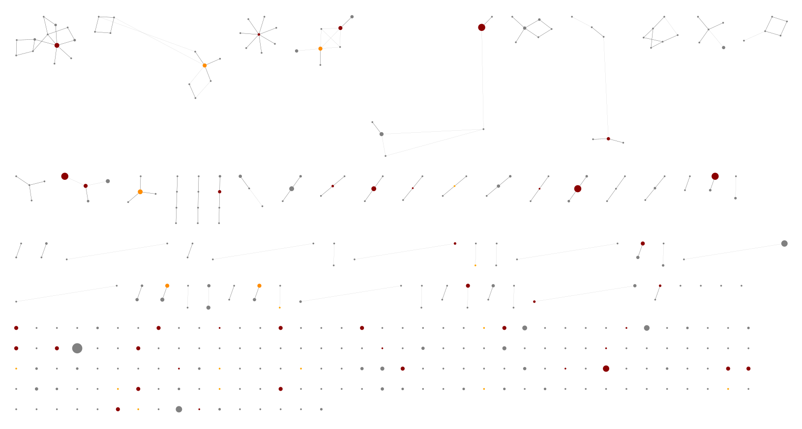
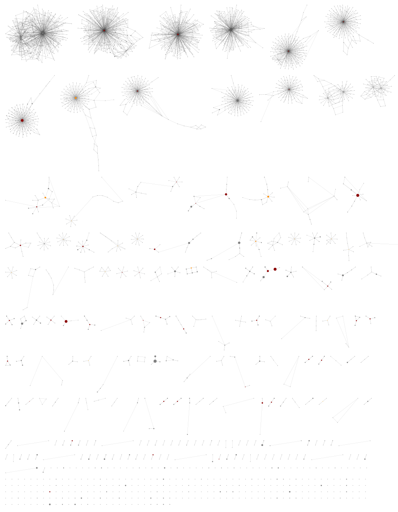

Minimum Abundance Threshold
===========================

With less samples multiplexed per sample than our own work (which guided the
default settings), these samples were sequenced at much higher depth:

.. code:: console

    $ cut -f 1,2,5 metadata.tsv
    <SEE TABLE BELOW>

As a table:

============= =============== ==========
run_accession library_name    read_count
============= =============== ==========
SRR7109326    m6-stds         817764
SRR7109327    m6-301-1        890561
SRR7109328    m6-mock3-32000b 943839
SRR7109329    m6-766-1        840068
SRR7109330    m6-744-2        704173
SRR7109331    m6-500-1        911793
SRR7109341    m6-712-2        872265
SRR7109342    m6-500-2        879762
SRR7109343    m6-757-1        903886
SRR7109344    m6-757-2        1210627
SRR7109345    m6-mock3-16000  922440
SRR7109406    m6-712-1        897159
SRR7109408    m6-744-1        778090
SRR7109409    m6-mock3-32000a 1125275
SRR7109411    m6-766-2        785776
SRR7109412    m6-755-1        957067
SRR7109414    m6-736-1        998817
SRR7109415    m6-301-2        1181567
SRR7109417    m6-755-2        1071829
SRR7109418    m6-736-2        919363
SRR7109420    m6-SynMock      1299238
============= =============== ==========

The defaults are an absolute abundance threshold of 100, and a fractional
threshold of 0.1% (i.e. ``-a 100 -f 0.001``). After merging overlapping reads
and primer matching we could expect over 650,000 reads per m6 sample, giving a
threshold over 650 reads.

So, with this coverage the default fractional abundance threshold of 0.1% makes
the default absolute abundance threshold of 100 redundant. However, on this
dataset our defaults are quite cautious, and control samples can help set
thresholds objectively.

In this dataset there is a single synthetic control for m6 sequencing run,
library ``SynMock`` aka ``SRR7109420``. We can tell THAPBI PICT at the command
line to use this to set the fractional abundance threshold via ``-y`` or
``--synctrls``, or set the absolute abundance threshold via ``-n`` or
``--negctrls`` (with a list of control file names). It turns out however that
with the default thresholds the control is clean (no unwanted non-synthetic
ITS2 reads).

So, there is scope to lower the default thresholds - but how low? We will start
by reproducing the Illumina part of Figure 6, which was based on the m6 MiSeq
sequencing run. This figure explores tag-switching in the demultiplexing, and
in the authors' analysis goes as low as 5 reads.

Excluding only singletons
-------------------------

The ``run.sh`` example starts by running the pipeline on the m6 dataset with
``-f 0 -a 2`` to accept everything except singletons (sequences which are only
seen once in a sample; including them gives about ten times as many unique
sequences which slows everything down). This first analysis does *not* use the
synthetic control to raise the threshold on the rest of the samples - we want
to see any low level mixing. We then can compare our sample report against
Figure 6.

Look at ``summary/a2.ITS2.samples.onebp.xlsx`` or working at the command line
with the TSV file:

.. code:: console

    $ cut -f 1,5-7,10-11,13-14 summary/a2.ITS2.samples.onebp.tsv
    <SEE TABLE BELOW>

As a table:

============= ========= ======= ======== ============= ============ ======== ======
#sample_alias Raw FASTQ Flash   Cutadapt Max non-spike Max spike-in Accepted Unique
============= ========= ======= ======== ============= ============ ======== ======
301-1         890561    812674  807956   348111        0            687950   39
301-2         1181567   1113606 1108129  457440        0            977003   41
500-1         911793    823392  819468   289229        0            689174   16
500-2         879762    817277  813470   214155        0            699634   20
712-1         897159    823034  820146   131937        0            703189   20
712-2         872265    800475  796363   299240        0            683057   20
736-1         998817    948348  943427   349965        15           834461   30
736-2         919363    858915  854919   282132        0            757097   18
744-1         778090    710762  706659   358089        0            614988   35
744-2         704173    654661  651528   136471        0            564238   40
755-1         957067    891942  887650   462493        15           782052   27
755-2         1071829   987280  982087   589120        0            848793   19
757-1         903886    839105  835431   281533        0            725057   40
757-2         1210627   1105530 1099959  224635        0            950457   39
766-1         840068    794475  792260   526535        0            712126   36
766-2         785776    714894  711176   251097        0            606887   37
BioMock       943839    872263  866253   56120         0            744007   32
BioMock       922440    859262  846519   65686         0            733784   30
BioMock       1125275   1047383 1023231  84748         3            884514   34
BioMockStds   817764    740627  736334   35300         0            628576   33
SynMock       1299238   1204532 1199806  187           103014       1043525  26
============= ========= ======= ======== ============= ============ ======== ======

Here ``SynMock`` (``SRR7109420``) is the synthetic control, and it has some
non-spike-in reads present, the most abundant at 187 copies. Conversely,
samples ``755-1`` (``SRR7109412``), ``736-1`` (``SRR7109414``), and one of the
BioMock samples (``SRR7109409``) have trace levels of unwanted synthetic
spike-in reads, the most abundant at 15, 15 and 3 copies respectively. The
counts differ, but these are all samples highlighted in Figure 6 (sharing the
same Illumina i7 or i5 index for multiplexing). We don't see this in the other
BioMock samples, but our pipeline appears slightly more stringent.

As percentages, 187/1199806 gives 0.0156% which is nearly ten times lower than
our default of 0.1%. The numbers the other way round are all even lower,
15/462496 gives 0.003%, 15/349965 gives 0.004%, and 3/1023234 gives 0.003%.

Using the synthetic control
---------------------------

Next the ``run.sh`` example uses the ``SynMock`` synthetic control to
automatically raise the fractional abundance threshold to 0.015% by including
``-y raw_data/SRR7109420_*.fastq.gz`` in the command line. This brings down
the unique sequence count enough to allow use of a slower but more lenient
classifier as well.

Look at ``summary/ctrl.ITS2.samples.1s5g.xlsx`` or working at the command line
with the TSV file:

.. code:: console

    $ cut -f 1,7,9-11,13-14 summary/ctrl.ITS2.samples.1s5g.tsv
    <SEE TABLE BELOW>

Note we now get a threshold column showing the absolute threshold applied to
each sample (using the inferred percentage), all above the absolute default of
100. You can see the total accepted read count has dropped, and the number of
unique sequences accepted has dropped even more dramatically:

============= ======== ========= ============= ============ ======== ======
#sample_alias Cutadapt Threshold Max non-spike Max spike-in Accepted Unique
============= ======== ========= ============= ============ ======== ======
301-1         807956   126       348111        0            579502   16
301-2         1108129  173       457440        0            829870   11
500-1         819468   128       289229        0            568336   16
500-2         813470   127       214155        0            578432   16
712-1         820146   128       131937        0            569100   19
712-2         796363   125       299240        0            570488   16
736-1         943427   148       349965        0            708900   16
736-2         854919   134       282132        0            653753   7
744-1         706659   111       358089        0            540597   11
744-2         651528   102       136471        0            472785   17
755-1         887650   139       462493        0            694273   10
755-2         982087   154       589120        0            754928   14
757-1         835431   131       281533        0            610579   13
757-2         1099959  172       224635        0            781212   12
766-1         792260   124       526535        0            648524   10
766-2         711176   111       251097        0            508838   16
BioMock       866253   136       56120         0            607401   30
BioMock       846519   132       65686         0            603186   30
BioMock       1023231  160       84748         0            718660   29
BioMockStds   736334   115       35300         0            526317   28
SynMock       1199806  100       187           103014       885051   16
============= ======== ========= ============= ============ ======== ======

Note that Palmer *et al.* (2018) apply a threshold to unique sequences, but
the thresholding strategy in THAPBI PICT applies the fractional threshold to
all the samples (given in the same sub-folder as input, so you can separate
your MiSeq runs, or your PCR plates, or just apply a global threshold).

In fact, looking at the read report ``summary/ctrl.ITS2.reads.1s5g.tsv`` it is
clear that while this threshold may have excluded Illumina tag-switching, it
has *not* excluded PCR noise - there are hundreds of low abundance sequences
unique to a single sample. To address that we have to use a considerably
higher threshold, and the default 0.1% is a reasonable choice here.

Using the defaults
------------------

The final step in ``run.sh`` is to run the pipeline with the default abundance
thresholds (sticter than the two analyses above).

Look at ``summary/defaults.ITS2.samples.1s5g.xlsx`` or working at the command
line with the TSV file:

.. code:: console

    $ cut -f 1,7,9-11,13-14 summary/defaults.ITS2.samples.1s5g.tsv
    <SEE TABLE BELOW>

As a table:

============= ======== ========= ============= ============ ======== ======
#sample_alias Cutadapt Threshold Max non-spike Max spike-in Accepted Unique
============= ======== ========= ============= ============ ======== ======
301-1         807956   808       348111        0            528957   10
301-2         1108129  1109      457440        0            778850   10
500-1         819468   820       289229        0            516474   8
500-2         813470   814       214155        0            529967   8
712-1         820146   821       131937        0            533310   13
712-2         796363   797       299240        0            520290   11
736-1         943427   944       349965        0            669563   12
736-2         854919   855       282132        0            609025   4
744-1         706659   707       358089        0            493209   6
744-2         651528   652       136471        0            452421   11
755-1         887650   888       462493        0            616322   6
755-2         982087   983       589120        0            669602   5
757-1         835431   836       281533        0            578198   9
757-2         1099959  1100      224635        0            742540   8
766-1         792260   793       526535        0            583643   7
766-2         711176   712       251097        0            469397   7
BioMock       866253   867       56120         0            591947   19
BioMock       846519   847       65686         0            585715   19
BioMock       1023231  1024      84748         0            698170   18
BioMockStds   736334   737       35300         0            521693   24
SynMock       1199806  1200      0             103014       862950   14
============= ======== ========= ============= ============ ======== ======

The accepted read counts have gone done a little further, as have the number
of unique sequences accepted for each sample. Looking at the mock community
controls, this may have gone a little too far...

Threshold selection
-------------------

Excluding only singletons is too lienent, but how does the default (0.1%)
compare to the synthetic control inferred threshold (0.0156%)?

Here are the classifier assessment values using the lower inferred threshold
which allows a lot of PCR noise:

.. code:: console

    $ head -n 2 summary/ctrl.ITS2.assess.1s5g.tsv
    <SEE TABLE BELOW>

As a table:

======== === == == === =========== =========== ========= ==== ============ ===========
#Species TP  FP FN TN  sensitivity specificity precision F1   Hamming-loss Ad-hoc-loss
======== === == == === =========== =========== ========= ==== ============ ===========
OVERALL  102 11 1  186 0.99        0.94        0.90      0.94 0.0400       0.105
======== === == == === =========== =========== ========= ==== ============ ===========

Versus the stricter higher default abundance fraction which excludes most of
the PCR noise:

.. code:: console

    $ head -n 2 summary/defaults.ITS2.assess.1s5g.tsv
    <SEE TABLE BELOW>

As a table:

======== == == == === =========== =========== ========= ==== ============ ===========
#Species TP FP FN TN  sensitivity specificity precision F1   Hamming-loss Ad-hoc-loss
======== == == == === =========== =========== ========= ==== ============ ===========
OVERALL  92 8  11 189 0.89        0.96        0.92      0.91 0.0633       0.171
======== == == == === =========== =========== ========= ==== ============ ===========

You could use the assessment metrics to help decide on your preferred
threshold, depending on the best tradeoff for your use-case.

Personally, of the these two I would pick the higher default threshold
since it appears to exclude lots of PCR noise as seen in the edit graphs.
With the default 0.1% threshold:

Using the lower threshold there are roughly ten times as many ASVs.
The more common ASV nodes become the centre of a halo of 1bp variants,
typically each seen in a single sample, which we attribute to PCR noise:

The best choice of threshold may lie somewhere in between?
