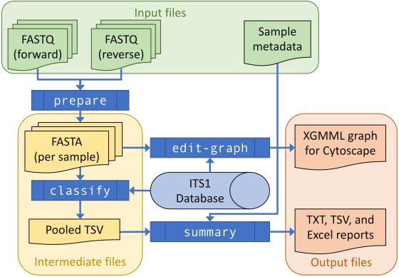

.. _woody_hosts:

Environmental *Phytophthora* ITS1
=================================

This example is based on the following paper from earlier in the THAPBI
Phyto-Threats project, where the original analysis used the precursor pipeline
``metapy``:

* Riddell *et al.* (2019) Metabarcoding reveals a high diversity of woody
  host-associated *Phytophthora* spp. in soils at public gardens and amenity
  woodlands in Britain. https://doi.org/10.7717/peerj.6931

Importantly, they used the same PCR primers, and therefore analysis with this
tool's default settings including the provided database is appropriate.

The :ref:`quick_start` described a simplified use of the THAPBI PICT tool to
assess a single Illumina MiSeq sequencing run using the ``thapbi_pict
pipeline`` command, as a flowchart:

Here we will run over the same process using real *Phytophthora* ITS1 data,
calling the individual commands within the default pipeline - and include
metadata for reporting. We then run the equivalent all-in-one pipeline command.

Finally, since the sample data includes some positive controls, we can look at
assessing the classifier performance.

.. toctree::
   :maxdepth: 1

   sample_data
   prepare
   classify
   metadata
   summary
   edit_graph
   pipeline
   assess
