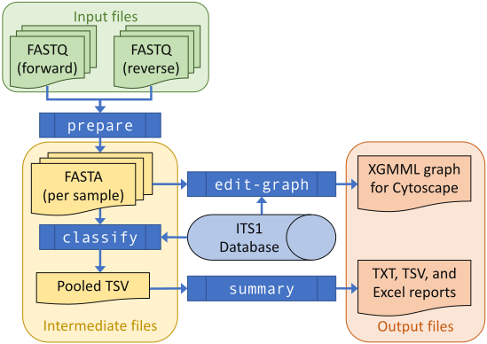

.. _introduction:

Introduction
============

THAPBI PICT is a tool designed to assess species content of metabarcode
amplicons sequenced using an overlapping paired-end Illumina protocol.
The input data is paired FASTQ files (one pair for each sample), from
which unique sequences and their abundance are reported alongside one or
more matching species or genus names.

In this illustrative flow chart of the default pipeline, the input paired
FASTQ files are green, the intermediate per-sample FASTA and TSV files are
yellow, and the output reports are in orange. The individual steps of the
pipeline are dark blue boxes, and the ITS1 or other marker database is a
pale blue cylinder.

Read preparation
----------------

The first stage of the pipeline goes from a set of paired FASTQ files to a
set of non-redundant primer trimmed FASTA files. This currently runs as
follows:

1. Merge overlappping reads into single sequences, using
   `Flash <https://ccb.jhu.edu/software/FLASH/>`_
   (`Magoc and Salzberg 2011 <https://doi.org/10.1093/bioinformatics/btr507>`_).
2. Filter for primers and trim to target region, using
   `Cutadapt <https://github.com/marcelm/cutadapt>`_
   (`Martin 2011 <https://doi.org/10.14806/ej.17.1.200>`_).
3. Apply a minimum abundance threshold (guided by any negative controls).

Sequence classification
-----------------------

The second stage of the pipeline offers a choice of classifier algorithms:

- 100% identity (``identity``). Requires the primer trimmed read sequence
  match a database entry exactly. The database entries must be trimmed too.
- Up to one base pair away (``onebp``, the *default*). Like the identity
  classifier, but allows a single base pair edit (a substitution, deletion,
  or insertion).
- Up to one base pair away for a species level match (like the default
  ``onebp`` method), but falling back on up to 3bp away for a genus level
  match (``1s3g``).
- Perfect substring (``substr``). Like the identity classifier, but also
  allows for the query sequence to be a perfect substring of a database entry.
  Useful if the database entries have not all been trimmed exactly.
- Top BLAST hit within database (``blast``). This classifier calls NCBI BLAST
  with a local database built of the database sequences, and takes the species
  of the top BLAST hit(s) subject to some minimum alignment quality to try to
  exclude misleading matches.
- Clustering using Swarm v2 (``swarm``). This classifier aimed to reproduce
  the methodology of ``metapy`` used in Riddell *et al.* (2019). For each
  sample, the reads are clustered with the database entries, and each cluster
  is assigned the species of any database entries in the cluster.
- Swarm v2 clustering with identity override (``swarmid``). As above, but if a
  sequence perfectly matches a database entry that taxonomy is used (ignoring
  any additional species which it might be clustered with).

These have different strengths and weaknesses, which depend in part on the
completeness of the database for the target environment. The ``identity``,
``substr`` and ``onebp`` classifiers are very strict, and with a sparse
database could leave a lot a lot of sequences with no prediction. On the other
hand, the ``blast``, ``swarm`` and ``swarmid`` classifiers are more fuzzy and
will make classifications on much looser criteria - but with a sparse database
those matches could be false positives.

In assessing the classification performance, it is the *combination* of both
classification method (algorithm) *and* marker database which which matters.

Classification output
---------------------

The classifier output is at unique sequence level, reporting zero or more
species matches (or genus matches if sequences in the database are recorded
at genus leve only).

For example, an ITS1 sequence from a known *Phytophthora infestans* single
isolate control can in addition to this expected result also perfectly match
sister species *P. andina* and *P. ipomoeae*. Here the classifier would report
all three species (sorted alphabetically), giving::

    Phytophthora andina;Phytophthora infestans;Phytophthora ipomoeae

If additionally the query sequence matched genus level only *Phytophthora*
entries in the database, that would be redundant information, and not reported
in this example.

Niether in this raw classification output, nor the provided reports, does
THAPBI PICT currently attempt any simiplification like last reporting the
common ancestor of a complex result. For the initial use case focused on
*Phytophthora*, this is simply not needed.

Reporting
---------

There are currently three main reports produced (in multiple formats including
formatted Excel spreadsheets).

- **Sample report**. Provides both a high level human readable sample report
  in text (including any sample metadata) and a tabular report. This has the
  samples as rows, and genus and species as columns, with combined sequence
  counts as values. Includes totals and unclassified counts as additional
  rows. Can include sample metadata as additional columns.
- **Read report**. Table of unique sequences as rows, and samples as columns,
  with read counts (sequence abundance) as values. Includes any species
  classification and the sequences themselves as additional columns. Can
  include sample metadata as additional rows.
- **Edit graph**. Represents all the unique sequences in the sample (plus
  optionally all those in the reference database) as nodes with edges between
  them for edit distance (solid black lines for 1bp, dashed grey for 2bp, and
  dotted grey for 3bp away). Any sequences also in the database are colored.

These are discussed and excerpts shown in the :ref:`worked examples
<worked_examples>` later in the documentation.
